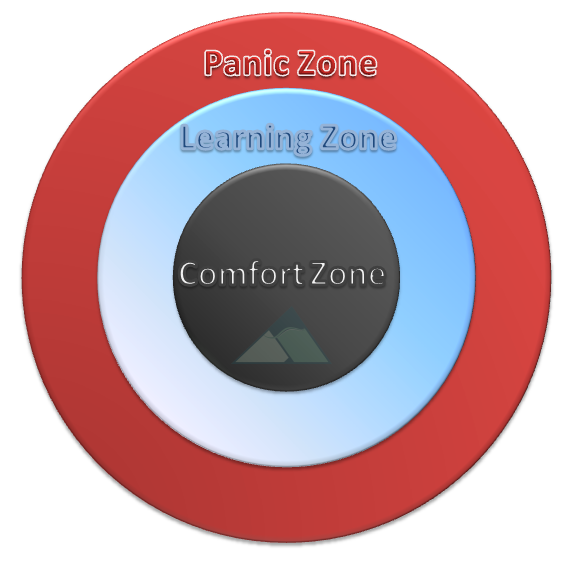
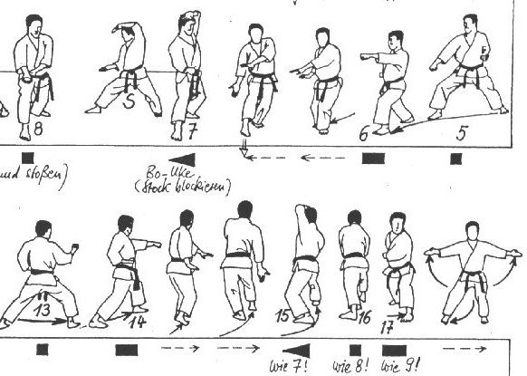
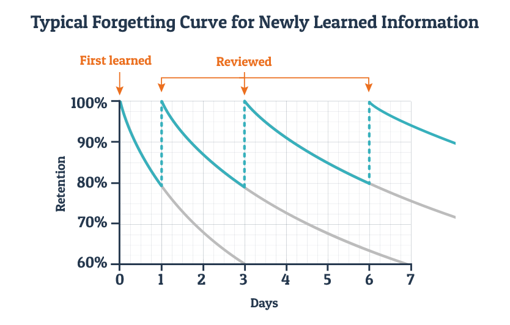

# How to learn effectively

One of the most important things we impart here is effective learning. When you graduate, you will have a lifetime of learning, languages, libraries, principles and tools ahead of you. The sooner we learn this, the better! (Warning: This will be as challenging as it is rewarding)

## You need to drive your own learning. Don't wait to be fed with knowledge

> "Education comes from within; you get it by struggle and effort and thought." (Napoleon Hill)

> "Education comes from the Latin word educare, which literally means 'led out,' in the sense of being drawn forth. I find that little tidbit really interesting, because we don’t generally think of education in that sense—of drawing forth something from the learner. Instead, it’s far more common to see education treated as something that’s done to the learner—as something that’s poured in, not drawn out. This model is especially popular in corporate training, with a technique that’s known as sheep dip training."

**You**. The most important ingredient in the learning process is you. You have to want to learn. Somebody can give me essential guide to becoming an origami master, but if I don't want it, then it doesn't matter what was given to me

## Stay in your learning zone

Keep learning new skills. Staying in your learning zone. Expending your comfort zone. Be aware when you are in panic zone (and avoid it!)

How do you know which zone you are in?

- If there is nothing new for you. Then you are in your comfort zone.
- If there is something you haven't heard about before, and you can relate it to something you already know, then you are in your learning zone.
- If there is something new, and you cannot relate it to anything you already know, as a result, you cannot understand this new concept at all. In this case, you are in your panic zone.

## Learn one thing at a time

Besides avoiding panic zone, another way to make your learning experience more enjoyable is to learn one thing at a time. If you try to pick up 3 new skills in one go, you might get lost or feel like in a panic zone.

## Learn 20% of the most important concepts in a new domain to solve 80% of the problems

You don't need to be an expert in some domain before you can solve problems. Actually, as some cool guy found out, you can learn the basics pretty quickly in just [20 hours](https://first20hours.com/).

After that, you build your comfort zone and you can keep expanding it.

## You need to use the knowledge you learnt

You probably had this experience before: you just finished reading a book, but after two weeks, you cannot recall the details of what you have read. This is very common. Our brains forget when it finds some information is not used and probably useless.

In order to retain the new knowledge you just learnt, you need to use it:

- Write a blog about it
- Teach the knowledge to another person. This is referred as [Feynman Technique](https://fs.blog/2012/04/feynman-technique/).
- Solve problems with the new knowledge

When you try to use the knowledge, you [actively recall it](https://en.wikipedia.org/wiki/Active_recall). That tells your brain this piece of information is important and your brain will save it in [long term memory](https://en.wikipedia.org/wiki/Long-term_memory) so that you don't forget it.

## Get your hands dirty quickly

When you learn a new tool, the best way of learning is to use it.

For example, if you learn a new programming language, you should start writing some codes with it after you [quickly glance through its syntax rules](https://learnxinyminutes.com/).

If you just keep reading, you feel that you "get it", while actually you don't, until you really try it out with your own hands.

Whenever you read a tutorial that has some sample codes in it, you should try out the sample codes yourself. It helps you to get a deeper understanding on the topics.

## Become more proficient with deliberate practice

If you truly want to master a skill, you need to do [deliberate practice](https://jamesclear.com/deliberate-practice-theory).

For programmers, a good format of practice is called [coding kata](http://codekata.com/) where you keep practicing basic moves so they become your [muscle memory](https://en.wikipedia.org/wiki/Muscle_memory). For those who can type your keyboard without looking at it, you know what I mean. Using coding katas, you can get familiar with language syntax and common APIs so that you are more productive when you solve real problems.

Another form of deliberate practice is called improvement kata, which helps you to focus on one area for improvement and design activities to achieve your goal.

## Memorize new knowledge with Spaced Repetition

How can we remember the new knowledge we just learned? A useful trick is called [Spaced Repetition](https://lifeinthefastlane.com/learning-by-spaced-repetition/).

As the picture shown below, if you review a new piece of knowledge 3 times within the next 7 days, you have a high chance to memorize it after some time.

If you are interested in such techniques, you may find a tool called [Anki](https://apps.ankiweb.net/) useful. It was created to help people learn new languages, but it's equally effective if you use it to memorize other facts.

## How to read a book

Really? Do I need to learn how to read a book? You might ask.

Yes, there are some tricks to read books more effectively. One of them is called SQ3R

- Survey: Scan the table of contents and chapter summaries for an overview.
- Question: Note any questions you have.
- Read: Read in its entirety.
- Recite: Summarize, take notes, and put in your own words.
- Review: Reread, expand notes, and discuss with colleagues.

There is also a famous book named [How to Read a Book](https://www.amazon.com/How-Read-Book-Classic-Intelligent/dp/0671212095)

## How to read the docs of a library

- use it like a dictionary. know the structure. know where to find things
- find the API docs (e.g. MDN is great for JavaScript)
- figure out what you want to do (e.g. split a string into an array)
- zoom in to the right place in the docs (e.g. `.split()`) (Google is always helpful) - understand the method, what it does, what parameters it takes in, what the parameters should look like (e.g. string, number, array, object, etc.), which parameters are required/optional, what the return value is

## Don't be afraid of making mistakes. Embrace failures.

There are two types of failures. There are the failures that are good for us that we can learn from. But there are failures that aren’t good for us. This second type of failure doesn’t produce any learning: it keeps us from learning in the first place, or it shuts down our learning in mid-experience.

## Resources

- [How to learn how to learn](https://flaviocopes.com/how-to-learn/)
- [How to Learn Programming Skills](https://www.codingblocks.net/podcast/how-to-learn-programming-skills/)
- [Learning How to Learn](https://www.coursera.org/learn/learning-how-to-learn)
- [How to memorize fact with active recall techniques](https://www.youtube.com/watch?v=ukLnPbIffxE)
- [Stop saying coding is easy](https://www.hanselman.com/blog/StopSayingLearningToCodeIsEasy.aspx)
- [Teach yourself programming in 10 years](http://norvig.com/21-days.html)
- [What I learned about learning](https://medium.com/@davified/what-i-learned-in-2017-about-learning-d185f1f38772)
- [Carol Dweck - Growth Mindset](https://www.youtube.com/watch?v=hiiEeMN7vbQ)
- [How to teach yourself hard things](https://jvns.ca/blog/2018/09/01/learning-skills-you-can-practice/)
- [Myth of the Genius Programmer](https://www.youtube.com/watch?v=0SARbwvhupQ)
- [The genius fallacy](http://jxyzabc.blogspot.com/2017/09/the-genius-fallacy.html)
- [Jargon.js](http://jargon.js.org/)
- [JavaScript Masterclass (this talk is not about JavaScript rather it's about how to navigate the road to expertise/mastery](https://www.youtube.com/watch?v=v0TFmdO4ZP0)

## Assignment

- [Follow this example, track what you learned everyday](https://github.com/jbranchaud/til)
- [Take the challenge to write code for 100 days](https://github.com/jbranchaud/til)
